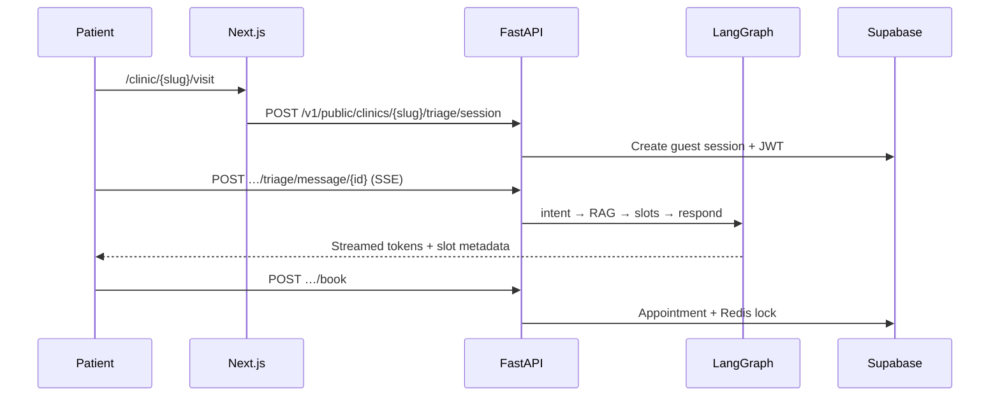

# Symptra — AI-First Patient Intake & Autonomous Scheduling

Production-grade platform for medical and dental clinics: streaming AI triage, autonomous booking, staff dashboards, and HIPAA-aware multi-tenant isolation.

| | |
|---|---|
| **Product** | Symptra Scheduling |
| **Compliance** | HIPAA-aware · RLS-enforced · BAA gating · Zero-PHI logs |
| **Stack** | Next.js 16 · Supabase · FastAPI · LangGraph · pgvector · Redis |
| **LLM** | Pluggable — Ollama · OpenAI · Gemini · Grok (`feature-flags.json`) |

---

## Overview

Symptra connects three audiences in one tenant-isolated workspace:

| Audience | How they access the app | Primary capabilities |
|---|---|---|
| **Clinic owner** | Sign up → onboarding → `/front-desk` | Doctors, billing, clinic docs, AI triage, settings, public booking page |
| **Staff (front desk)** | Invite acceptance | Appointments, patients, AI triage escalations |
| **Doctor** | Email invite → `/doctor` | Schedule, patients, triage queue, intake forms |
| **Patient (guest)** | `/clinic/{slug}/visit` — **no account** | AI chat, slot picker, details, confirmation |

**Design principles**

- **Network boundary** — LLM keys, service-role keys, and EHR credentials stay on the backend. The browser talks to Next.js; Next.js proxies to FastAPI.
- **Tenant isolation** — Row-Level Security on all clinic data. JWT claims carry `tenant_id` and `role`.
- **Deterministic safety** — Emergency keyword detection and Redis distributed locks override AI where clinical or scheduling integrity requires it.

---

## Tech Stack

| Layer | Technology | Role |
|---|---|---|
| Frontend | Next.js 16 (App Router), React 19, Tailwind 4, shadcn/ui | Marketing site, staff dashboards, public booking |
| State | Redux Toolkit + RTK Query | Client state, API caching, auth session |
| Auth & DB | Supabase (PostgreSQL 16, Auth, Realtime) | Users, RLS, migrations, Realtime escalations |
| Vectors | pgvector | Clinic document RAG |
| Backend | FastAPI, Python 3.12, Gunicorn/Uvicorn | AI gateway, scheduling, ingest, compliance |
| Agents | LangGraph | Triage graph — intent, RAG, slots, booking, escalation |
| Cache / locks | Redis 8 | Slot locking, rate limits |
| LLM | `backend/feature-flags.json` | Hot-swappable chat + embedding providers |
| Tests | Vitest (frontend), pytest (backend) | Unit and integration tests |

---

## Repository Structure

```
Autonomous-Scheduling-Platform/
├── frontend/                      # Next.js application
│   └── src/
│       ├── app/
│       │   ├── (auth)/            # Sign-in, onboarding, accept-invite, public booking
│       │   │   └── clinic/[slug]/[[...step]]/   # Guest patient flow (visit → details → confirmed)
│       │   └── (platform)/        # Staff dashboards (owner, doctor, staff)
│       ├── components/
│       │   ├── auth/              # Onboarding, invites, session sync, AuthBootstrap
│       │   ├── booking/           # Public clinic booking client screens
│       │   ├── patient-triage/    # Chat UI, slot picker, streaming hooks
│       │   ├── appointments/      # Calendar, front-desk workspace
│       │   ├── clinic-docs/       # Document upload + RAG ingestion
│       │   ├── doctors/           # Doctor dashboard, schedule, triage queue
│       │   ├── platform/          # Marketing home page sections
│       │   └── common/            # Layout, settings, shared hooks, Redux store
│       ├── lib/
│       │   ├── nav/roleNav.ts     # Sidebar nav per role (keep in sync with proxy)
│       │   └── proxy/roleAccess.ts # Route guards (used by src/proxy.ts)
│       └── proxy.ts               # Auth, role redirects, Supabase session cookies
│
├── backend/                       # FastAPI AI microservice
│   ├── app/
│   │   ├── api/v1/endpoints/      # triage, public, schedule, ingest, staff, compliance, …
│   │   ├── adapters/llm/          # Ollama, OpenAI, Gemini, Grok providers
│   │   ├── core/                  # config, security, feature flags, JWT
│   │   └── services/              # LangGraph agent, RAG, scheduling, Supabase client
│   ├── feature-flags.json         # Switch AI provider without code changes
│   └── supabase/migrations/       # Schema + RLS (run db:push from backend/)
│
├── docker-compose.yml             # Redis + API (port 8000)
├── docs/                          # Architecture, migrations, deployment, HIPAA
└── package.json                   # Monorepo scripts (dev, test, db:*)
```

---

## Architecture

### Public patient booking (no login)



### Staff-authenticated triage

Staff and internal tools use `/v1/triage/*` with a Supabase JWT (`tenant_id` + role). Owners manage knowledge base at `/clinic-docs`; patients never see that UI.

See [docs/ARCHITECTURE.md](./docs/ARCHITECTURE.md) for full module layout and data-flow tables.

---

## Getting Started

### Prerequisites

- Node.js 20+
- Python 3.12+
- Docker & Docker Compose (for Redis + optional containerized API)
- A [Supabase](https://supabase.com) project

### 1. Install dependencies

```bash
npm run setup          # frontend + backend npm deps, Python venv
```

### 2. Environment files

**Frontend**

```bash
cp frontend/.env.example frontend/.env.development
```

| Variable | Description |
|---|---|
| `NEXT_PUBLIC_SUPABASE_URL` | Supabase project URL |
| `NEXT_PUBLIC_SUPABASE_ANON_KEY` | Supabase anon key |
| `NEXT_PUBLIC_API_URL` | FastAPI base URL (`http://localhost:8000`) |

**Backend**

```bash
cp backend/.env.example backend/.env.development
```

| Variable | Description |
|---|---|
| `SUPABASE_URL` | Supabase project URL |
| `SUPABASE_SERVICE_ROLE_KEY` | Service-role key (server only) |
| `SUPABASE_JWT_SECRET` | JWT secret for Bearer verification |
| `FRONTEND_ORIGIN` | CORS origin (`http://localhost:3000`) |
| `REDIS_URL` | `redis://localhost:6379/0` (local) or Docker internal URL |
| `GEMINI_API_KEY` | Google AI Studio key (if using Gemini) |
| `OPENAI_API_KEY` | OpenAI key (if using OpenAI) |

Configure the **Custom Access Token Hook** in Supabase → Authentication → Hooks → `public.custom_access_token_hook`.

### 3. Database migrations

Full guide: [docs/DATABASE_MIGRATIONS.md](./docs/DATABASE_MIGRATIONS.md).

```bash
cd backend && npx supabase login    # once

npm run db:validate
export SUPABASE_DB_PASSWORD='<database-password>'
npm run db:link -- --project-ref <ref>   # once
npm run db:push                          # apply pending migrations
npm run gen:types                        # sync frontend/src/types/database.ts
```

Run `npm run db:push` after pulling new migrations, then `npm run gen:types`.

### 4. AI provider

Edit `backend/feature-flags.json` — no redeploy needed when `hot_reload` is true:

```json
"ai": {
  "chat_provider": "gemini",
  "embedding_provider": "gemini"
}
```

| Provider | Env key | Notes |
|---|---|---|
| `ollama` | — | Local [Ollama](https://ollama.com) at `http://localhost:11434` |
| `openai` | `OPENAI_API_KEY` | GPT-4o-mini + text-embedding-3-small |
| `gemini` | `GEMINI_API_KEY` | gemini-2.0-flash + text-embedding-004 |
| `grok` | `GROK_API_KEY` | xAI Grok |

Check status: `GET /v1/ai/status` (also after backend starts).

### 5. Start development

**Option A — Monorepo (Docker API + Next.js)**

```bash
npm run dev            # docker API + Redis in background, frontend on :3000
npm run stop           # tear down Docker services
```

**Option B — Local hot-reload backend (recommended for backend work)**

```bash
npm run stop                              # free port 8000
cd backend && npm run dev                 # Uvicorn --reload on :8000
cd frontend && npm run dev                # separate terminal
```

> Only one process can bind port **8000** — stop the Docker `api` service before running `backend/npm run dev`.

**URLs**

| URL | Purpose |
|---|---|
| [http://localhost:3000](http://localhost:3000) | Marketing home |
| [http://localhost:3000/clinic/{slug}/visit](http://localhost:3000/clinic/your-slug/visit) | Guest patient booking |
| [http://localhost:3000/front-desk](http://localhost:3000/front-desk) | Owner dashboard |
| [http://localhost:8000/docs](http://localhost:8000/docs) | FastAPI OpenAPI |

### 6. Tests

```bash
npm test                    # backend pytest + frontend vitest
npm run test:backend
npm run test:frontend
npm run lint
```

---

## Roles & Navigation

Sidebar items are defined in `frontend/src/lib/nav/roleNav.ts` and enforced in `frontend/src/lib/proxy/roleAccess.ts`.

| Role | Home | Key routes |
|---|---|---|
| **Owner** (`admin`) | `/front-desk` | Doctors, patients, appointments, AI triage, **clinic docs**, settings, billing |
| **Staff** (`clinic_admin`) | `/front-desk` | Appointments, patients, AI triage, settings |
| **Doctor** | `/doctor` | Appointments, patients, schedule, triage queue, intake forms |

**HIPAA BAA** — Owners acknowledge the BAA under **Settings** to enable AI chat and document embedding. See [docs/HIPAA_COMPLIANCE.md](./docs/HIPAA_COMPLIANCE.md).

---

## API Overview

Interactive docs: [http://localhost:8000/docs](http://localhost:8000/docs)

| Prefix | Auth | Description |
|---|---|---|
| `/v1/public/clinics/{slug}/*` | Guest JWT | Public booking, triage SSE, book appointment |
| `/v1/triage/*` | Staff JWT | Internal triage sessions, SSE, escalation |
| `/v1/schedule/*` | Staff JWT | Slots, appointments, calendar & booking page config |
| `/v1/ingest/*` | Owner JWT | Document upload, embedding jobs, chunks |
| `/v1/staff/*` | Staff JWT | Invites, doctors, dashboards |
| `/v1/compliance/*` | Staff JWT | BAA status, acknowledge, audit report |
| `/v1/settings/*` | Staff JWT | Workspace settings |
| `/v1/ai/*` | Staff JWT | Provider status, reload feature flags |

---

## Security & Compliance

| Control | Implementation |
|---|---|
| Row-Level Security | All tenant tables; isolation via JWT `tenant_id` |
| Role-based routes | Next.js `proxy.ts` + `roleAccess.ts` |
| PHI-safe logging | Structured JSON logger redacts sensitive fields |
| API key isolation | LLM and service-role keys in backend env only |
| BAA gating | `require_tenant_baa()` blocks AI ingest/chat when unsigned |
| Emergency override | Keyword interceptor short-circuits LangGraph |
| Slot integrity | Redis distributed locks on booking |

---

## Documentation

| Document | Contents |
|---|---|
| [docs/ARCHITECTURE.md](./docs/ARCHITECTURE.md) | Module layout, backend layers, data flow |
| [docs/DATABASE.md](./docs/DATABASE.md) | Schema, RLS, pgvector |
| [docs/DATABASE_MIGRATIONS.md](./docs/DATABASE_MIGRATIONS.md) | Supabase CLI workflow |
| [docs/DEPLOYMENT.md](./docs/DEPLOYMENT.md) | Vercel, Railway, CI/CD |
| [docs/HIPAA_COMPLIANCE.md](./docs/HIPAA_COMPLIANCE.md) | Pre-launch checklist |
| [frontend/README.md](./frontend/README.md) | Frontend module conventions |
| [backend/README.md](./backend/README.md) | Backend scripts and layout |

---

## License

Proprietary & Confidential — Not for Distribution.
