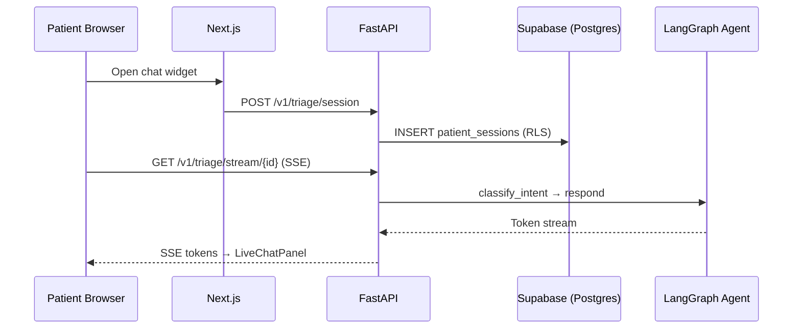

# AI-First Patient Intake & Autonomous Scheduling Platform

Production-grade platform for high-end medical and dental clinics — AI-driven patient intake, autonomous scheduling, and HIPAA-aware multi-tenant data isolation.

| | |
|---|---|
| **Version** | 1.0 — Sprints 1–4 complete |
| **Compliance** | HIPAA-Aware · GDPR-Aligned · RLS Enforced · Zero-PHI Logs |
| **Stack** | Next.js · Supabase · FastAPI · LangGraph · pgvector · OpenAI |
| **Audience** | Senior Engineers, Tech Leads, DevOps, QA, Compliance Officers |

---

## Overview

This platform delivers an AI-first patient intake widget and staff dashboard for clinic operations. Patients interact through a streaming chat interface; a LangGraph agent handles triage, RAG lookups, and booking; front-desk staff receive real-time escalations via Supabase Realtime.

**Design principles:**

- **Network boundary** — LLM API keys, service-role keys, and EHR credentials never reach the browser. The Next.js frontend talks only to route handlers; route handlers forward to FastAPI.
- **Tenant isolation** — Every table enforces Row-Level Security. JWT claims carry `tenant_id` injected at login.
- **Deterministic safety** — Emergency keyword detection and distributed Redis locks override AI behavior where clinical or scheduling integrity requires it.

---

## Tech Stack

All packages are pinned to current stable releases as of June 2026.

| Technology | Version | Role |
|---|---|---|
| [Next.js](https://nextjs.org) (App Router) | 16.2.x | Frontend — RSC, streaming SSR, route handlers |
| [React](https://react.dev) | 19.2.x | UI runtime |
| [Tailwind CSS](https://tailwindcss.com) | 4.x | Utility-first styling |
| [shadcn/ui](https://ui.shadcn.com) | latest | Accessible, in-repo component primitives |
| [Redux Toolkit](https://redux-toolkit.js.org) + RTK Query | 2.12.x | Global state + server-state caching |
| [Supabase](https://supabase.com) (PostgreSQL 16) | JS 2.107.x · Python 2.31.x | Auth, RLS, Realtime, pgvector |
| [FastAPI](https://fastapi.tiangolo.com) | 0.136.x | Async AI microservice gateway |
| [Python](https://python.org) | 3.12 | Backend runtime |
| [LangGraph](https://langchain-ai.github.io/langgraph/) | 1.2.x | Stateful multi-agent orchestration |
| [OpenAI](https://platform.openai.com) | GPT-4o / text-embedding-3-small | LLM + 1536-dim embeddings |
| [pgvector](https://github.com/pgvector/pgvector) | — | Native Postgres vector search |
| [Redis](https://redis.io) (Upstash / local) | 8.x | Distributed slot-locking |
| [Vitest](https://vitest.dev) | 4.x | Frontend unit tests |
| [pytest](https://pytest.org) | 9.x | Backend integration tests |

---

## Repository Structure

```
Autonomous-Scheduling-Platform/
├── frontend/                  # Next.js 16 App Router application
│   └── src/
│       ├── common/            # Shared components, hooks, utils (cross-module only)
│       ├── components/
│       │   ├── ui/            # shadcn/ui primitives (Button, Input, Badge, …)
│       │   └── patient-triage/  # Sprint 1 — live patient chat module
│       │       ├── atoms/
│       │       ├── molecules/
│       │       ├── organisms/
│       │       └── screens/
│       ├── hooks/             # useStreamingChat, useAuthSession
│       ├── store/             # Redux slices + RTK Query API
│       ├── lib/supabase/      # Browser + server Supabase clients
│       └── middleware.ts      # Subdomain → tenant slug routing
│
├── backend/                   # FastAPI AI microservice
│   ├── app/
│   │   ├── main.py            # App init, CORS, lifespan warm-up
│   │   ├── api/v1/endpoints/  # triage (session, SSE stream)
│   │   ├── core/              # config, security (JWT), PHI-safe logger
│   │   └── services/          # LangGraph agent, Supabase client
│   └── supabase/              # Supabase CLI project (run db:* from backend/)
│       ├── config.toml
│       └── migrations/        # PostgreSQL schema + RLS policies
│
├── docker-compose.yml         # FastAPI + Redis for local development
└── docs/                      # Detailed architecture, schema, roadmap
```

### Planned modules (Sprints 2–4)

| Module | Path | Status |
|---|---|---|
| Patient Triage | `frontend/src/components/patient-triage/` | **Sprint 1 — implemented** |
| Clinic Docs (RAG ingestion) | `frontend/src/modules/clinic-docs/` | Sprint 2 |
| Appointments Dashboard | `frontend/src/modules/appointments/` | Sprint 4 |
| Schedule API | `backend/app/api/v1/endpoints/schedule.py` | Sprint 3 |
| Ingest API | `backend/app/api/v1/endpoints/ingest.py` | Sprint 2 |

---

## Architecture



The FastAPI service is the sole AI processing gateway. See [docs/ARCHITECTURE.md](./docs/ARCHITECTURE.md) for the full module layout, backend clean-architecture layers, and system interaction table.

---

## Getting Started

### Prerequisites

- Node.js 20+
- Python 3.12+
- Docker & Docker Compose
- A [Supabase](https://supabase.com) project (PostgreSQL 16)

### 1. Database

Apply the schema to your Supabase project:

```bash
npm install --prefix backend
npm run db:link -- --project-ref <ref>   # once
npm run db:validate
npm run db:push                          # applies backend/supabase/migrations/*.sql
npm run gen:types                        # sync frontend/src/types/database.ts
```

Or run SQL manually in the Supabase SQL editor from `backend/supabase/migrations/`.

Configure the **Custom Access Token Hook** in Supabase Dashboard → Authentication → Hooks, pointing to `public.custom_access_token_hook`.

### 2. Environment Variables

**Frontend** — copy and fill `frontend/.env.example`:

```bash
cp frontend/.env.example frontend/.env.local
```

| Variable | Description |
|---|---|
| `NEXT_PUBLIC_SUPABASE_URL` | Supabase project URL |
| `NEXT_PUBLIC_SUPABASE_ANON_KEY` | Supabase anon (public) key |
| `NEXT_PUBLIC_API_URL` | FastAPI base URL (default `http://localhost:8000`) |

**Backend** — copy and fill `backend/.env.example`:

```bash
cp backend/.env.example backend/.env
```

| Variable | Description |
|---|---|
| `SUPABASE_URL` | Supabase project URL |
| `SUPABASE_SERVICE_ROLE_KEY` | Service-role key (server only, never expose) |
| `SUPABASE_JWT_SECRET` | JWT secret for Bearer token verification |
| `FRONTEND_ORIGIN` | Allowed CORS origin (default `http://localhost:3000`) |
| `REDIS_URL` | Redis connection string |

### 3. Start Services

```bash
# Terminal 1 — Redis + FastAPI
docker compose up

# Terminal 2 — Next.js frontend
cd frontend && npm install && npm run dev
```

Open [http://localhost:3000/chat](http://localhost:3000/chat) for the patient chat widget.

### 4. Run Tests

```bash
# Frontend (Vitest)
cd frontend && npm test

# Backend (pytest)
cd backend && pip install -r requirements.txt && pytest
```

---

## API Reference (Sprint 1)

All endpoints require `Authorization: Bearer <supabase_jwt>` with a valid `tenant_id` claim.

| Method | Endpoint | Description |
|---|---|---|
| `POST` | `/v1/triage/session` | Create a patient intake session |
| `GET` | `/v1/triage/stream/{session_id}` | SSE token stream from LangGraph agent |

Planned endpoints (Sprints 2–4): `/v1/schedule/*`, `/v1/ingest/*`, `/v1/triage/escalate/{id}`.

---

## Security & Compliance

| Control | Implementation |
|---|---|
| Row-Level Security | All tables; tenant isolation via JWT `tenant_id` claim |
| PHI-safe logging | Structured JSON logger redacts `patient_phone`, `patient_email` |
| API key isolation | OpenAI / service-role keys live in FastAPI env only |
| CORS | Restricted to `FRONTEND_ORIGIN` in production |
| Audit trail | Append-only `audit_logs` table (Sprint 4) |
| Emergency override | Deterministic keyword interceptor (Sprint 3) |

See [docs/DATABASE.md](./docs/DATABASE.md) for the full target schema, RLS policy matrix, and pgvector RAG setup.

---

## 28-Day Roadmap

| Sprint | Days | Focus | Status |
|---|---|---|---|
| **Sprint 1** | 1–7 | Multi-tenant groundwork, patient chat UI, SSE streaming | In progress |
| **Sprint 2** | 8–14 | Clinic policy ingestion & RAG pipeline | Planned |
| **Sprint 3** | 15–21 | LangGraph scheduling agent & triage engine | Planned |
| **Sprint 4** | 22–28 | Human handoffs, dashboard & production hardening | Planned |

Full deliverables, edge cases, and test criteria: [docs/ROADMAP.md](./docs/ROADMAP.md).

---

## Documentation Index

| Document | Contents |
|---|---|
| [docs/ARCHITECTURE.md](./docs/ARCHITECTURE.md) | Frontend module layout, backend layers, data flow |
| [docs/DATABASE.md](./docs/DATABASE.md) | Schema, RLS policies, pgvector, audit logs |
| [docs/ROADMAP.md](./docs/ROADMAP.md) | 28-day sprint execution map with test goals |
| [docs/DEPLOYMENT.md](./docs/DEPLOYMENT.md) | Infrastructure overview, Vercel/Railway deploy, CI/CD |
| [docs/HIPAA_COMPLIANCE.md](./docs/HIPAA_COMPLIANCE.md) | Pre-launch HIPAA checklist, verification scripts |
| [docs/BREACH_NOTIFICATION.md](./docs/BREACH_NOTIFICATION.md) | 60-day HIPAA breach notification procedure |
| [frontend/README.md](./frontend/README.md) | Frontend-specific dev notes |

---

## License

Proprietary & Confidential — Not for Distribution.
