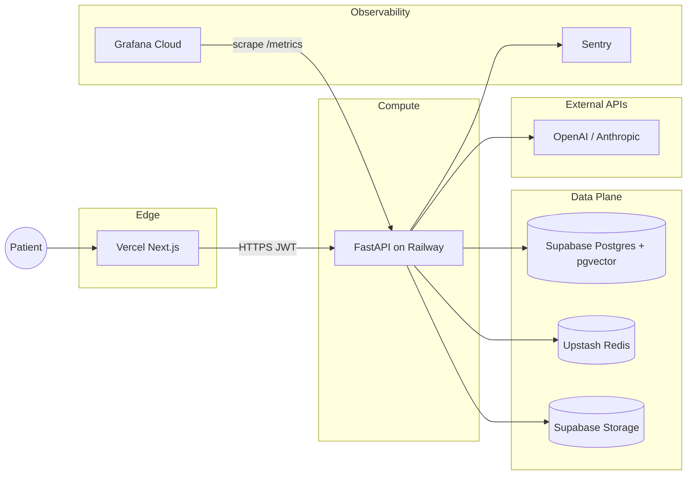

# Section 5 — Deployment, Infrastructure & CI/CD

## 5.1 Infrastructure Overview

| Component | Provider | Notes |
|---|---|---|
| **Next.js Frontend** | Vercel | Edge network, automatic HTTPS, preview deploys per PR |
| **FastAPI Microservice** | Railway.app or AWS ECS | Dockerized, auto-scaled, private network egress |
| **PostgreSQL + pgvector** | Supabase Cloud | Managed, HIPAA-eligible, automated backups |
| **Redis (Distributed Locks)** | Upstash Redis | Serverless, pay-per-request, global replication |
| **LLM APIs** | OpenAI + Anthropic | Proxied through FastAPI — keys never reach browser |
| **File Storage** | Supabase Storage | Private buckets with signed URLs, encrypted at rest |
| **Error Monitoring** | Sentry | PHI-scrubbed before upload, session replay disabled |
| **Metrics / Observability** | Grafana Cloud + Prometheus | FastAPI `/metrics` endpoint, uptime alerting |
| **CI/CD** | GitHub Actions | Test → Lint → Build → Deploy pipeline on `main` |

---

## Architecture Diagram



---

## CI/CD Pipeline (Section 5.2)

Workflow: [`.github/workflows/deploy.yml`](../.github/workflows/deploy.yml)

| Job | Steps | Trigger |
|---|---|---|
| `test-backend` | pytest + coverage (Redis service), Codecov upload | Every push / PR to `main` |
| `test-frontend` | lint → type-check → unit tests → Playwright e2e | Every push / PR to `main` |
| `deploy-backend` | Railway (`fastapi-triage` service) | `main` push only |
| `deploy-frontend` | Vercel `--prod` | `main` push only |

### Required GitHub Secrets

| Secret | Used By | How to Obtain |
|---|---|---|
| `VERCEL_TOKEN` | Vercel deploy | Vercel Dashboard → Settings → Tokens |
| `VERCEL_ORG_ID` | Vercel deploy | `vercel link` or team settings |
| `VERCEL_PROJECT_ID` | Vercel deploy | `vercel link` output |
| `RAILWAY_TOKEN` | Railway deploy | Railway Dashboard → Account → Tokens |
| `RAILWAY_PROJECT_ID` | Railway deploy | Project Settings → General |
| `SUPABASE_URL` | Backend CI (optional) | Falls back to test defaults |
| `SUPABASE_SERVICE_KEY` | Backend CI (optional) | Maps to `SUPABASE_SERVICE_ROLE_KEY` |
| `SUPABASE_JWT_SECRET` | Backend CI (optional) | Falls back to test defaults |
| `OPENAI_API_KEY` | Backend CI (optional) | For integration tests |
| `NEXT_PUBLIC_SUPABASE_URL` | Frontend CI (optional) | Falls back to placeholders |
| `NEXT_PUBLIC_SUPABASE_ANON_KEY` | Frontend CI (optional) | Falls back to placeholders |
| `CODECOV_TOKEN` | Coverage upload (optional) | codecov.io |

Configure the `production` environment in GitHub with required reviewers before first deploy.

### HIPAA compliance gate

The `compliance-check` job runs `scripts/compliance/scan-codebase-for-phi-logging.sh` on every PR. Complete the full pre-launch checklist in [HIPAA_COMPLIANCE.md](./HIPAA_COMPLIANCE.md) before processing real patient data.

---

## Frontend — Vercel

**Root directory:** `frontend/`

```bash
cd frontend
vercel link
vercel env pull .env.local
```

### Environment Variables (Vercel)

| Variable | Example | Notes |
|---|---|---|
| `NEXT_PUBLIC_SUPABASE_URL` | `https://xxx.supabase.co` | Public |
| `NEXT_PUBLIC_SUPABASE_ANON_KEY` | `eyJ...` | Public anon key only |
| `NEXT_PUBLIC_API_URL` | `https://api.yourclinic.com` | Railway backend URL |
| `NEXT_PUBLIC_SENTRY_DSN` | `https://...@sentry.io/...` | Optional |
| `NEXT_PUBLIC_ENVIRONMENT` | `production` | |

Preview deployments are created automatically for every pull request.

---

## Backend — Railway

**Root directory:** `backend/` (see [`railway.toml`](../backend/railway.toml))

```bash
cd backend
railway login
railway link
railway up
```

### Environment Variables (Railway)

| Variable | Notes |
|---|---|
| `SUPABASE_URL` | Supabase project URL |
| `SUPABASE_SERVICE_ROLE_KEY` | Server-only, never expose to frontend |
| `SUPABASE_JWT_SECRET` | JWT verification |
| `UPSTASH_REDIS_URL` | `rediss://...` for distributed locks |
| `OPENAI_API_KEY` | LLM gateway |
| `FRONTEND_ORIGIN` | Vercel production URL (CORS) |
| `SENTRY_DSN` | PHI-scrubbed error reporting |
| `ENVIRONMENT` | `production` |

Health check: `GET /health` (configured in `railway.toml` and Dockerfile).

---

## Database — Supabase

Schema is versioned in `backend/supabase/migrations/`. The FastAPI backend owns the database; the frontend consumes generated types only.

### Local

```bash
npm install --prefix backend
npm run db:link -- --project-ref <ref>   # once
npm run db:validate
npm run db:push
npm run gen:types                        # refresh frontend/src/types/database.ts
```

### CI/CD (GitHub Actions)

| Job | When | Action |
|---|---|---|
| `validate-database` | Every PR / push | Filename + layout checks (`scripts/db/validate-migrations.sh`) |
| `deploy-database` | Push to `main` | `supabase db push` via `scripts/db/push.sh` |
| `deploy-backend` / `deploy-frontend` | After migrations | Railway + Vercel deploy |

Required GitHub secrets (production environment):

| Secret | Purpose |
|---|---|
| `SUPABASE_ACCESS_TOKEN` | Supabase CLI auth ([Account → Access Tokens](https://supabase.com/dashboard/account/tokens)) |
| `SUPABASE_PROJECT_REF` | Project ref from Supabase dashboard URL |
| `SUPABASE_DB_PASSWORD` | Database password (if required by `supabase link`) |

Migrations run **before** app deploys so API/frontend always target an up-to-date schema.

**Pre-launch checklist:**

- [ ] Execute Supabase HIPAA BAA (qualifying plan)
- [ ] Enable automated backups (default on Pro+)
- [ ] Configure Custom Access Token Hook
- [ ] Schedule `purge_expired_patient_sessions()` via pg_cron or Edge Function

---

## Observability

### Prometheus Metrics

FastAPI exposes `GET /metrics` (Prometheus text format).

Grafana Cloud scrape config example:

```yaml
scrape_configs:
  - job_name: asp-api
    scrape_interval: 30s
    metrics_path: /metrics
    static_configs:
      - targets: ["api.yourclinic.com:443"]
    scheme: https
```

### Sentry

- Backend: `SENTRY_DSN` — PHI scrubbed via `before_send` in `app/core/sentry.py`
- Frontend: `NEXT_PUBLIC_SENTRY_DSN` — scrubbed via `sanitizePHI()` in `SentryInit`
- Session replay: **disabled** (`sendDefaultPii: false`)

### Uptime Alerting

Point Grafana Cloud synthetic checks or UptimeRobot at:

- `https://your-app.vercel.app` (frontend)
- `https://api.yourclinic.com/health` (backend)

---

## Local Development

```bash
docker compose up --build    # Redis + FastAPI
cd frontend && npm run dev   # Next.js on :3000
```

---

## AWS ECS Alternative

The same [`backend/Dockerfile`](../backend/Dockerfile) can deploy to ECS/Fargate:

1. Push image to ECR
2. Task definition with env vars from AWS Secrets Manager
3. ALB health check on `/health`
4. Private subnet egress for Supabase / Upstash / OpenAI

Railway is the recommended path for Sprint delivery; ECS for enterprise VPC requirements.
